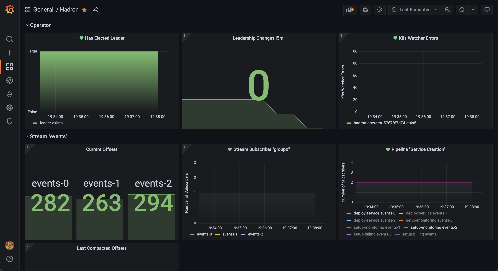

Monitoring
==========
All Hadron components, including the Operator and Streams, are instrumented with Prometheus metrics.

Metrics exposed by Hadron components can be easily collected using `ServiceMonitors` & `PodMonitors` which come from the Prometheus Operator project. The Hadron helm chart can optionally generate these monitors for you by setting `prometheusOperator.enabled=true`. More details are included in the [Helm chart's README](https://github.com/hadron-project/hadron/tree/main/charts/hadron-operator#prometheus-operator--kube-prometheus-stack-integration).

Hadron components expose their metrics over standard HTTP, and can be easily collected using any other pattern supported by Prometheus, such as direct Prometheus discovery and scraping, the OTEL collector, and the like.

## Monitoring Mixin
Hadron monitoring can also be configured using [Monitoring Mixins](https://monitoring.mixins.dev/#how-to-use-mixins). We are currently in the process of adding the Hadron mixin to the official mixin's site, however the functionality is the same:
- Vendor the Hadron mixin into the repo with your infrastructure config using [jsonnet-bundler](https://github.com/jsonnet-bundler/jsonnet-bundler): `jb install https://github.com/hadron-project/hadron/monitoring/hadron-mixin`,
- Generate the Hadron mixin config files (dashboards, alerts, rules &c) along with whatever customizations you would like,
- Then apply the generated config files to your monitoring stack.

Generating the config and making customizations to it is described in the [Monitoring Mixins docs here](https://monitoring.mixins.dev/#customising-the-mixin).

Out of the box, a reference Hadron dashboard is included which can help with getting started. The following image is based on the [Pipeline Transactional Processing demo app](../usecases/transactional-processing.md):

<div style="text-align:center;"></div>

## Metrics
The following metrics are exposed by the various Hadron components, which are accessible on port `7002` at the path `/metrics` on each respective component.

### Operator
```
# HELP hadron_operator_is_leader a gauge indicating if this node is the leader, where 1.0 indicates leadership, any other value does not
# TYPE hadron_operator_is_leader gauge
hadron_operator_is_leader

# HELP hadron_operator_num_leadership_changes the number of leadership changes in the operator consensus group
# TYPE hadron_operator_num_leadership_changes counter
hadron_operator_num_leadership_changes

# HELP hadron_operator_watcher_errors a counter of errors encountered while watching resources in the K8s API
# TYPE hadron_operator_watcher_errors counter
hadron_operator_watcher_errors

# HELP process_max_fds Maximum number of open file descriptors.
# TYPE process_max_fds gauge
process_max_fds

# HELP process_open_fds Number of open file descriptors.
# TYPE process_open_fds gauge
process_open_fds

# HELP process_resident_memory_bytes Resident memory size in bytes.
# TYPE process_resident_memory_bytes gauge
process_resident_memory_bytes

# HELP process_threads Number of OS threads in the process.
# TYPE process_threads gauge
process_threads

# HELP process_virtual_memory_bytes Virtual memory size in bytes.
# TYPE process_virtual_memory_bytes gauge
process_virtual_memory_bytes

# HELP process_virtual_memory_max_bytes Maximum amount of virtual memory available in bytes.
# TYPE process_virtual_memory_max_bytes gauge
process_virtual_memory_max_bytes
```

### Stream
```
# HELP hadron_pipeline_active_instances the number of active pipeline instances
# TYPE hadron_pipeline_active_instances gauge
hadron_pipeline_active_instances

# HELP hadron_pipeline_last_offset_processed the last offset to be processed by the pipeline
# TYPE hadron_pipeline_last_offset_processed counter
hadron_pipeline_last_offset_processed

# HELP hadron_pipeline_stage_subscriptions the number of stage subscribers currently registered
# TYPE hadron_pipeline_stage_subscriptions gauge
hadron_pipeline_stage_subscriptions

# HELP hadron_pipelines_watcher_errors k8s watcher errors from the pipelines watcher
# TYPE hadron_pipelines_watcher_errors counter
hadron_pipelines_watcher_errors

# HELP hadron_secrets_watcher_errors k8s watcher errors from the secrets watcher
# TYPE hadron_secrets_watcher_errors counter
hadron_secrets_watcher_errors

# HELP hadron_stream_current_offset the offset of the last entry written to the stream
# TYPE hadron_stream_current_offset counter
hadron_stream_current_offset

# HELP hadron_stream_subscriber_last_offset_processed stream subscriber group last offset processed
# TYPE hadron_stream_subscriber_last_offset_processed counter
hadron_stream_subscriber_last_offset_processed

# HELP hadron_stream_subscriber_group_members stream subscriber group members count
# TYPE hadron_stream_subscriber_group_members gauge
hadron_stream_subscriber_group_members

# HELP hadron_stream_subscriber_num_groups number of subscribers currently registered on this stream
# TYPE hadron_stream_subscriber_num_groups gauge
hadron_stream_subscriber_num_groups

# HELP hadron_streams_watcher_errors k8s watcher errors from the streams watcher
# TYPE hadron_streams_watcher_errors counter
hadron_streams_watcher_errors

# HELP hadron_tokens_watcher_errors k8s watcher errors from the tokens watcher
# TYPE hadron_tokens_watcher_errors counter
hadron_tokens_watcher_errors

# HELP process_max_fds Maximum number of open file descriptors.
# TYPE process_max_fds gauge
process_max_fds

# HELP process_open_fds Number of open file descriptors.
# TYPE process_open_fds gauge
process_open_fds

# HELP process_resident_memory_bytes Resident memory size in bytes.
# TYPE process_resident_memory_bytes gauge
process_resident_memory_bytes

# HELP process_threads Number of OS threads in the process.
# TYPE process_threads gauge
process_threads

# HELP process_virtual_memory_bytes Virtual memory size in bytes.
# TYPE process_virtual_memory_bytes gauge
process_virtual_memory_bytes

# HELP process_virtual_memory_max_bytes Maximum amount of virtual memory available in bytes.
# TYPE process_virtual_memory_max_bytes gauge
process_virtual_memory_max_bytes
```
